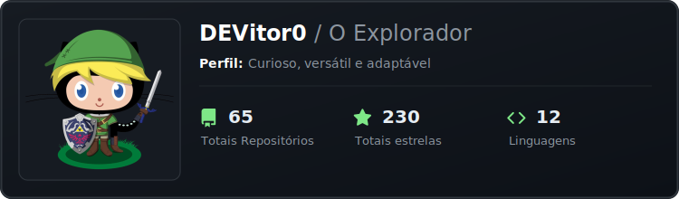
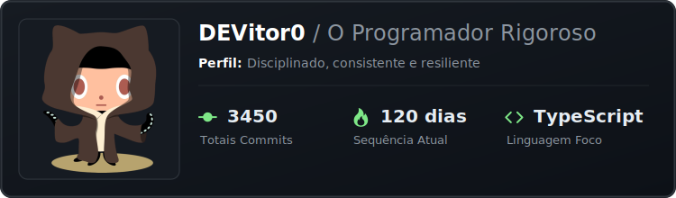
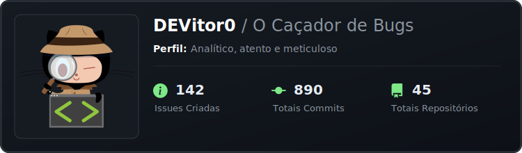
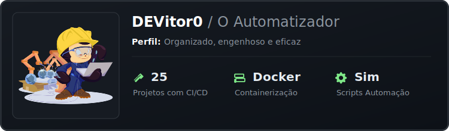
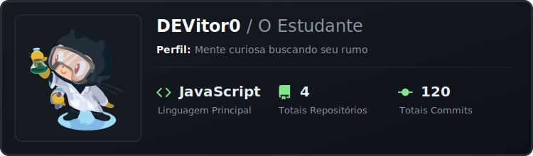

# 🐙 GitPersona - A identidade visual do seu código

> **Transforme commits em personalidade.** Uma análise comportamental que converte seus dados do GitHub em cards visuais de alta qualidade. O sistema utiliza métricas de repositórios, linguagens e frequência de commits para categorizar seu estilo de desenvolvimento em um card informativo. 


## 🎯 Impacto no Perfil Profissional

A utilização do GitPersona no seu `README.md` vai além da estética. Trata-se de **Data Visualization** aplicada ao marketing pessoal.

### Benefícios para o Desenvolvedor
- **Síntese de Competências**: Condensa anos de trabalho e milhares de linhas de código em uma visualização única e compreensível.
- **Prova Social de Atividade**: Demonstra consistência (streaks) e volume de trabalho (commits) de forma irrefutável.
- **Identidade Comportamental**: Revela seu **estilo de trabalho** (Explorador, Vigoroso, Caçador de Bugs), focando na forma como você interage com código e projetos.

### Visão para Tech Recruiters e RH
Recrutadores técnicos analisam dezenas de perfis diariamente. O GitPersona atua como um **resumo executivo** das suas hard skills:

1.  **Redução de Ruído**: Em vez de navegar por dezenas de repositórios, o recrutador tem um snapshot imediato do seu momento profissional e principais interesses.
2.  **Prova de Prática Real**: Vai além do currículo estático, validando que o candidato está ativamente codando, aprendendo e contribuindo no dia a dia.
3.  **Indicadores de Soft Skills (Baseado em Métricas Reais)**:
    *   **Disciplina & Resiliência**: Calculado via *Streaks* e frequência de commits (Persona Vigoroso).
    *   **Curiosidade & Adaptabilidade**: Mensurado pela diversidade de linguagens e volume de repositórios (Persona Explorador).
    *   **Foco em Qualidade & Resolução**: Identificado via análise semântica de commits (`fix`, `bug`, `resolve`) e interação em Issues (Persona Caçador de Bugs).
    *   **Pensamento Sistêmico**: Validado pelo uso de ferramentas de automação e CI/CD (Persona Automatizador).
    *   **Foco & Evolução**: Detectado pela consolidação de uma stack principal e crescimento constante de repositórios (Persona Estudante).


## 🧬 Descubra seu Arquétipo







## 🚀 Como Adicionar ao Seu Perfil (Passo a Passo)

Siga este guia para configurar o GitPersona no seu repositório de perfil (aquele com o mesmo nome do seu usuário, ex: `seunome/seunome`).

### Passo 1: Configurar a Automação
1.  No seu repositório, clique na aba **Actions** ou crie o arquivo manualmente.
2.  Crie um arquivo no caminho: `.github/workflows/persona.yml`
3.  Cole o seguinte código dentro dele:

```yaml
name: Update GitPersona

on:
  schedule:
    - cron: '0 0 * * *' # Executa todo dia à meia-noite
  workflow_dispatch: # Permite rodar manualmente clicando em um botão

jobs:
  build:
    runs-on: ubuntu-latest
    permissions:
      contents: write
    steps:
      - uses: actions/checkout@v3
      
      - name: Generate Persona Card
        uses: devitor0/GitPersona@main
        with:
          github_token: ${{ secrets.GITHUB_TOKEN }}
          username: ${{ github.repository_owner }}
          output_dir: dist
          
      - name: Commit & Push
        run: |
          git config user.name github-actions
          git config user.email github-actions@github.com
          git add dist/persona.svg
          git commit -m "chore: update persona card" || exit 0
          git push
```

### Passo 2: Gerar o Primeiro Card
1.  Vá até a aba **Actions** do seu repositório.
2.  No menu lateral esquerdo, clique em **Update GitPersona**.
3.  Clique no botão **Run workflow**.
4.  Aguarde alguns segundos até ficar verde ✅.
5.  Isso criará uma pasta `dist` na raiz do seu projeto com o arquivo `persona.svg`.

### Passo 3: Adicionar ao README
Agora basta adicionar a imagem ao seu perfil. Copie e cole o código abaixo no seu `README.md`, alterando apenas seu usuário e repositório:

```markdown
<p align="center">
  
</p>
```

> **Nota:** O parâmetro `?raw=true` no final do link é **obrigatório** para que a imagem apareça corretamente.

## 👨‍💻 Autor

**Vitor Moreira** - Desenvolvedor

- 📧 Email: vitormoreira6940@gmail.com
- 🔗 LinkedIn: www.linkedin.com/in/devitor0
- 🐙 GitHub: https://github.com/DEVitor0